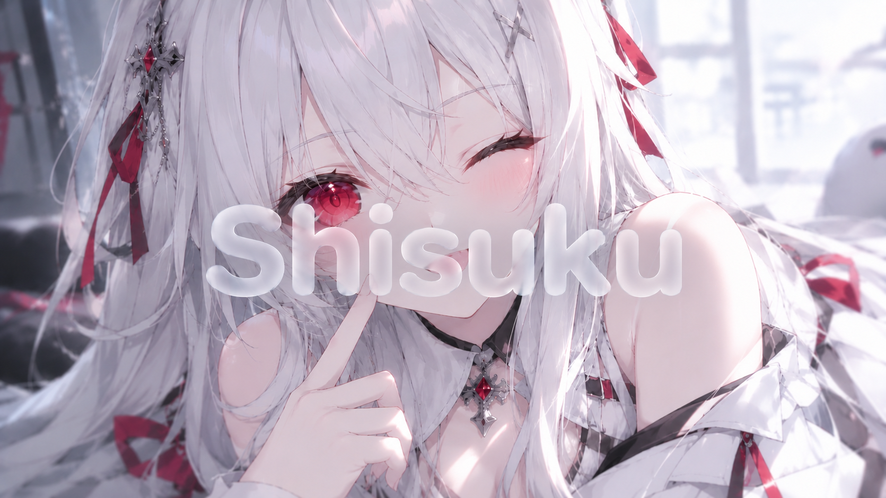

# Shizuku

**雫 — A Galgame engine as simple as making a slideshow.**

---

## What is this

Shizuku is a **visual Galgame / visual novel engine**.

The core idea is simple:

> Making a Galgame shouldn't be harder than making a slideshow.

Drag in a background, a character sprite, a dialogue box. Connect slides to represent branches. Hit preview.

No code. No complicated engine. No endless configuration.

Shizuku exists to make something that should be simple, simple again.

---

## Why "Shizuku"

**雫 (しずく)** means "waterdrop" in Japanese.

A drop of water is small and light, yet it can reflect the entire world.
We want Shizuku to be the same — **lightweight, clear, unassuming, but capable of holding your story**.

---

## Goals

- **As simple as slides** — drag, connect, preview. Zero barrier to entry.
- **As capable as Ren'Py** — scripting, variables, saves, rollback. Everything you need.
- **As light as the web** — runs in a browser, exports to HTML, small desktop builds.
- **As pure as a visual novel** — focused on storytelling, no feature bloat.

---

## Roadmap

First release planned for **2027**.

Currently in the **design phase**, working on:

- [ ] Engine architecture design
- [ ] Script DSL design
- [ ] Visual editor prototype
- [ ] Rendering layer selection
- [ ] Save / rollback mechanism design

> Progress will be updated continuously. If this direction interests you, consider starring and following.

---

## Tech Stack (Tentative)

| Layer | Technology |
|---|---|
| Editor UI | React + TypeScript |
| Stage Rendering | PixiJS |
| Data Format | JSON |
| Runtime | TypeScript |
| Desktop Packaging | Tauri |

> Tech choices may still change. Final design takes precedence.

---

## Design Principles

1. **Simplicity first** — if it can be done in one step, don't make it two.
2. **Visual first** — if it can be dragged, don't make users write code.
3. **Story first** — everything serves the narrative.
4. **Lightweight first** — no unnecessary dependencies or complexity.

---

## Get Involved

Shizuku is still in a very early stage.

If you'd like to:

- Share ideas or feedback → open an [Issue](https://github.com/)
- Follow progress → hit Star
- Join later → follow first, design docs coming soon

---

## License

MIT

---

**Shizuku — Tell your story, drop by drop.**
